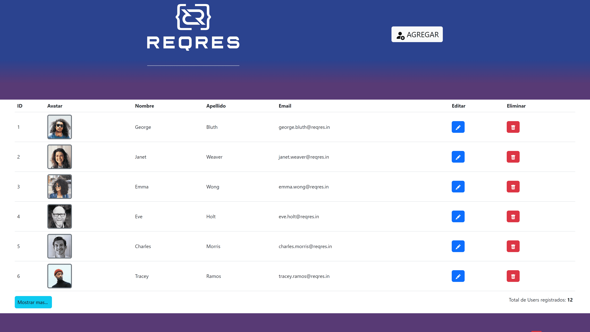

# API-UsersConsultant-reqres.in

Using the **API-Rest** from the website [reqres.in](https://reqres.in/)  which contains the documentation of a public **API**. I have created a new **HTML** file and a **JS** file to program the instructions needed to meet the following requirements, using Bootstrap for the layout, fetch to make requests to the backend, **jQuery** to manipulate the **HTML** and **SweetAlert** to display warnings to the user.

## Characteristics:

When loading the page (ready), show the list of all the *"users"* (Read of all the resources, that is, a get of all the resources). Show a loading image while the response arrives and then hide the loading image when the results are displayed.

Button with the text *"Add"* that shows a modal window with necessary inputs to introduce the data of a new *"user"*. In the modal window, a *"Save"* button was included that calls the API to register the new *"user"* (Create a resource, that is, a post from a resource). If the response is successful, display a success message and hide the modal window, otherwise display an error message and keep the modal window visible. If the registration is successful, the new registration should appear at the end of the previous objective listing.

When clicking on a *"user"*, a modal window is shown with inputs necessary to modify the data of the *"user"*. In the modal window, a *"Save"* button was included that calls the API to modify the *"user"*. To achieve this, an API call is made to obtain the data of the *"user"* on which the click was made (Read from a specific resource, that is, get from a particular resource using its unique identifier). When the response from the backend arrives, it must be displayed in the modal window inputs initialized with the data received from the backend, so that the user can modify them.

By clicking on the ***"Save"*** button, a call is made to the **API** to update the user's data (Update of a resource). Upon arrival of the **API** response, display a success or error message depending on the response.

Next to each user, a button or link that allows you to delete that *"user"* (Delete a resource using its unique identifier). It is programmed that when clicking on that button, it will call the API to delete that *"user"*. If the response is successful, that user is removed from the list (a loading image will be displayed while the response arrives).